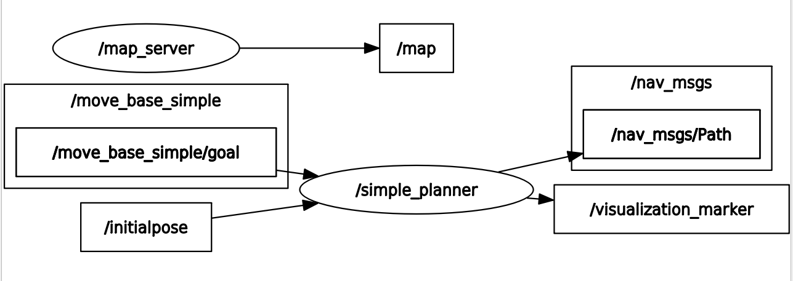
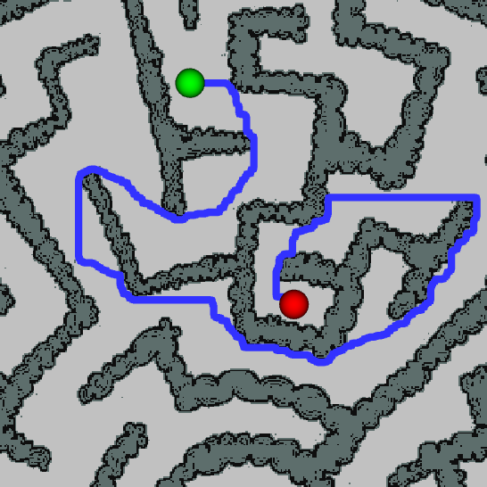
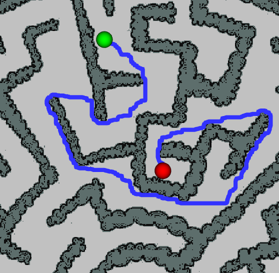

# Simple Planner 
This project has been realized for the Robot Programming course of the Master of Science in Artificial Intelligence and Robotics. It consists of a ROS C++ implementation of a simple path planner using the A* search algorithm.

## Table of Contents

- [Prerequisites](#prerequisites)
- [Installation](#installation)
- [Workspace Setup](#workspace-setup)
- [Building the Project](#building-the-project)
- [Running the Project](#running-the-project)
- [Description and Features](#description-and-features)
- [Results](#results)

## Prerequisites

Before installing, make sure you have the following dependencies:

- **ROS Distro:** ROS Noetic
- **Ubuntu Version:** Ubuntu 20.04
- Additional dependencies, e.g., `catkin`, `roscpp`, `rospy`, `cv_bridge`, `geometry_msgs`, `roslib`, `visualization_msgs`

You can install ROS by following the official [ROS installation guide](http://wiki.ros.org/ROS/Installation).

## Installation

1. Clone the repository into your ROS workspace:

    ```bash
    cd ~/catkin_ws/src
    git clone https://github.com/AngeloGianfelice/SimplePlanner.git
    ```

2. Install necessary dependencies (if any):

    ```bash
    rosdep install --from-paths src --ignore-src -r -y
    ```

## Workspace Setup

1. Make sure your ROS environment is set up correctly:

    ```bash
    source /opt/ros/noetic/setup.bash
    ```

2. Set up the catkin workspace:

    ```bash
    cd ~/catkin_ws
    catkin_make
    source devel/setup.bash
    ```

## Building the Project

To build the project, use:

```bash
cd ~/catkin_ws
catkin_make
source devel/setup.bash
```

## Running the Project 

The entire project can be run with one command, using the launch file:

```bash
roslaunch simple_planner simple_planner.launch 
```

Moreover you can also launch the project with 3 optional parameters:
1. **distance** function (euclidean or manhattan), used to compute the heuristic for the A* algorithm
2. **filename**, the name of the map you want to use (e.g. maze.jpg, diag.png etc..)
   Note that if you change the filename parameter you will also have to:
   - insert the new map in the *maps* folder (if not already there)
   - modify the map.yaml file with the appropriate filename      
4. **threshold**, an integer between 0 and 255 used to tell apart traversable pixel (those with values above the             threshold)      and obstacles (those with values below the threshold). In general darker pixel will be classified as      obstacle while       brighter pixels as free space.
   
An example of launching with optional parameters would be:

```bash
roslaunch simple_planner simple_planner.launch distance:=manhattan filename:=diag.png threshold:=200 
```

## Description and Features ##

The project is mainly handled by 2 different ros nodes (as shown in picture below):

1. **map_server**
   - Description: This is the built-in ros map_server node that provides map data.
   - Published Topics:
     - */map*: Publishes map.
        
2. **simple_planner**
   - Description: A node that computes and publishes path based on user inputs.
   - Subscribed Topics:
     - */initialpose*: Receives starting position from rviz user input.
     - */move_base_simple/goal*: Receives goal position from rviz user input.
   - Published Topics:
     - */nav_msgs*: Publishes the computed path.
     - */visualization_marker*: Publishes rviz markers.



### Search Algorithm ###
The search algorithm chosen to find the correct path is the __A*__ algorithm, one of the most popular pathfinding techniques. Fistly the map is rapresented as a **binary grid** of pixel (using the parameter *threshold* described before, we divide the map into traversable pixels and obstacles). Each grid element is associated to a specific value of an evaluation function **f(n)** computed as follows:

$$
f(n) = c(n) + h(n)
$$

where n is the next point on the path, **c(n)** is the cost of the path from the start point to n, and **h(n)** is a *heuristic function* that estimates the cost of the cheapest path from n to the goal. A* star then gradually computes the correct path by iteratively exploring the point with the current lowest value of the f function. As the heuristic function the user can choose between two different distance function (using the input parameter *distance*):

$$
Euclidean = \sqrt{(x_2 - x_1)^2 + (y_2 - y_1)^2}
$$

$$
Manhattan = |x_2 - x_1| + |y_2 - y_1|
$$

where (x1,y1) and (x2,y2) are the coordinates of the points whose distance we are looking for.

Finally the computed path is published to rviz, along with some markers for the start and goal positions for better visualization.

## Results ##
The image below show the path computed by the simple_planner node on different maps (with default parameters), visualized through rviz:


Here we can see the side by side differrence between the path computed with different heuristics:

| Euclidean            | Manhattan              |
|----------------------|----------------------|
|  |  |


